<!-- 
header: 'IME - Instituto Militar de Engenharia'
footer: 'Apresentação: Lorran Santos Rodrigues | Email: lorran.rodr@gmail.com | Professor: Dr. Marcos dos Santos' 
-->

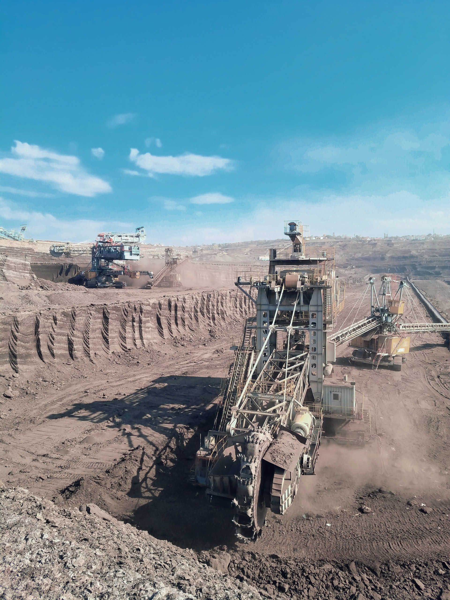

##### Mineração de Dados 🎲⛏️

---
<!-- 
header: ''
footer: '' 
-->

### Sobre o Autor:
* 🎓 Formado em Engenharia Mecânica pelo CEFET-RJ
* 👨‍🔬 4 anos de experiência com apoio a decisão (Data Science)
* ✏️ Data Scientist na Eleva Educação
---

# Objetivo Geral 🎯
---

* Elucidar os principais conceitos relacionados a mineração de dados
* Técnica de Clusterização K-Médias
* Aplicação prática em um problema de classificação

---

# Estrutura da Aula
---

- ## 📝 Contextualização
- ## 🎱 K-Médias
- ## 🧠 Mão na Massa
- ## ✅ Conclusão

---

# 📝 Contextualização

---

>Informação é o petróleio do século 21, e 'analytics' é o seu motor de combustão

###### ***Peter Sondergaard, senior vice president, Gartner Research.***

---

* Explosão da quantidade de dados disponíveis
  *  coleta e disponibilidade
* submersos em dados, porém sem informação
* Necessidade de Analise em escala
---
<!-- header: '' -->

## O que é Mineração de Dados?

---
<!-- footer: 'Han, J., Pei, J., & Kamber, M. (2011). Data mining: concepts and techniques. Elsevier.' -->
> Extração de padrões interessantes (não triviais, implicitos, previamente desconhecidos e potencialmente úteis) ou conhecimento de porções de dados massivas
---
<!-- footer: '' -->

## O que **não** é Mineração de Dados?
---

* **Sistemas Especialistas**
  - Ex.: Sistema Especialista em Detecção de falhas de veículos
  - baseado na experiência
* **Buscas em Bancos** 
  * SQL

---

 
# Aplicações

---
* #### 🔐 Detecção de Fraude
* #### 👷 Detecção de Falha
* #### 👨 👩 🧓 👶  Segmentação de Clientes
* #### :chart_with_upwards_trend: Analise de Risco
* #### 📖 Mineração de Texto
...

---

## Como Funciona a Mineração de Dados?
---
<!-- footer: 'Fig.1: Diagrama do Processo CRISP-DM para mineração de dados' -->

---
<!-- footer: '' -->

## Propositos da Mineração de Dados

---
* ## Descritivo
  * Contrastar e Sumarizar caracteristicas no conjunto de dados

---
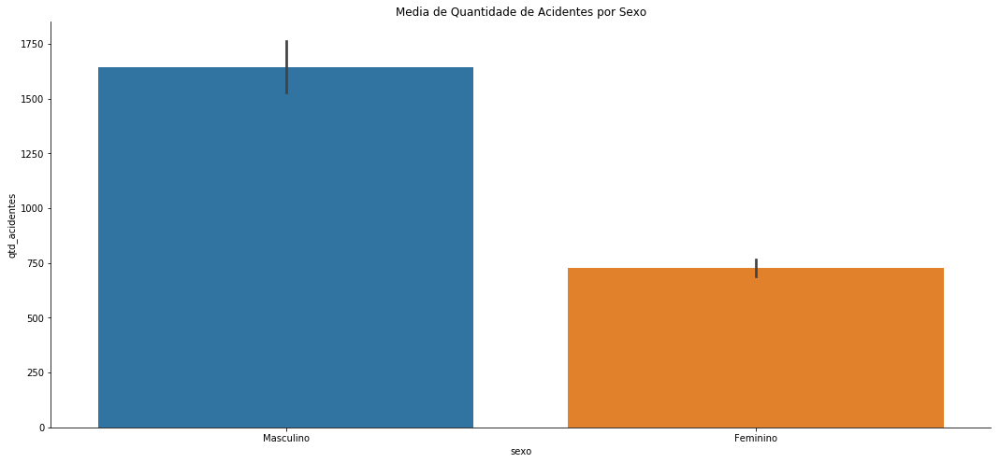

---

* Associativo
  * Correlações e Causalidade
* Classificação
  * Constroi modelos que descriminam classes
---

* ## Análise de Tendências
  * regressão
  * Periodicidade, Padrão sequencial

---

## Analise de Outliers
  * Encontrar as classes que não se comportam como o esperado para maioria

---

## Análise de Clusters
  * Classes são desconhecidas
  * Maximiza similaridade intra-classes e minimiza a similiridade inter-classe 

---

# K-Médias

---

---
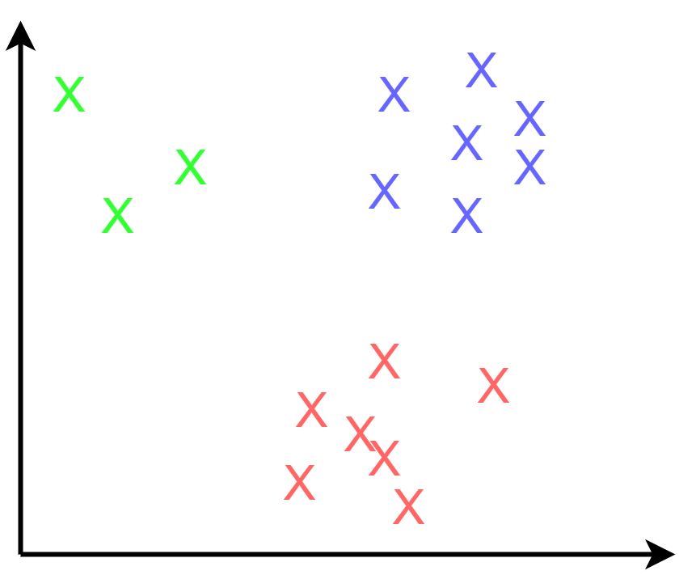

---

## Como Funciona?
---
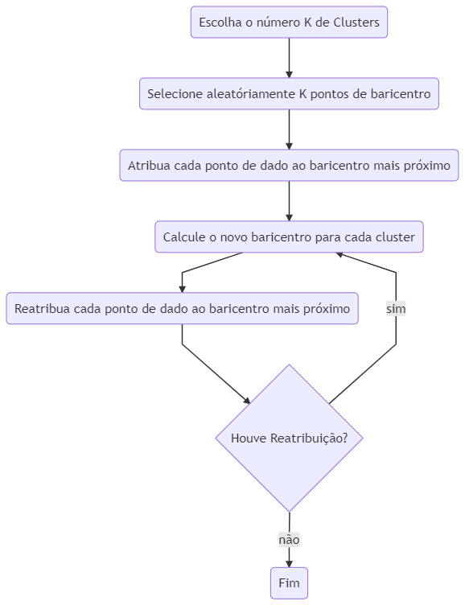

---
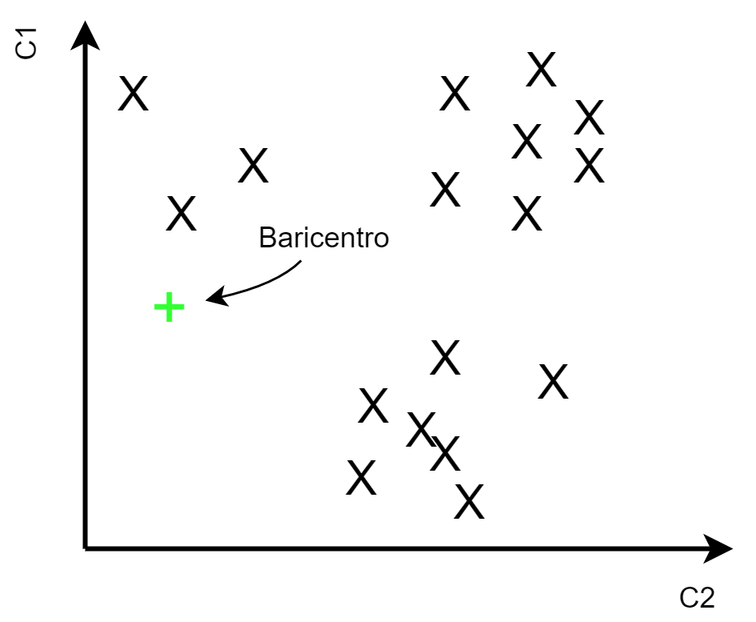

---
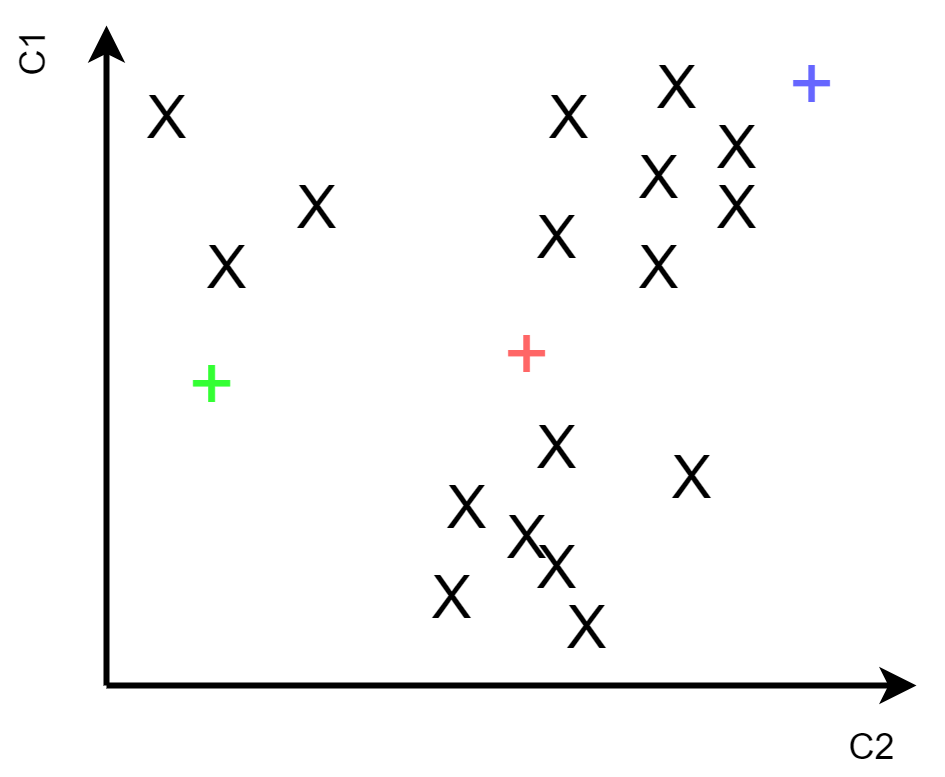

---
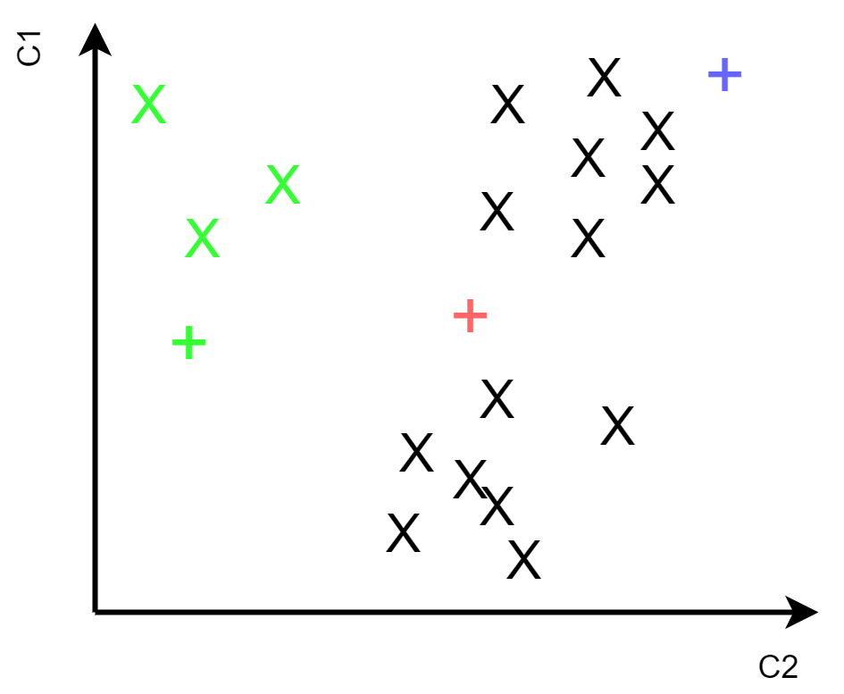

---
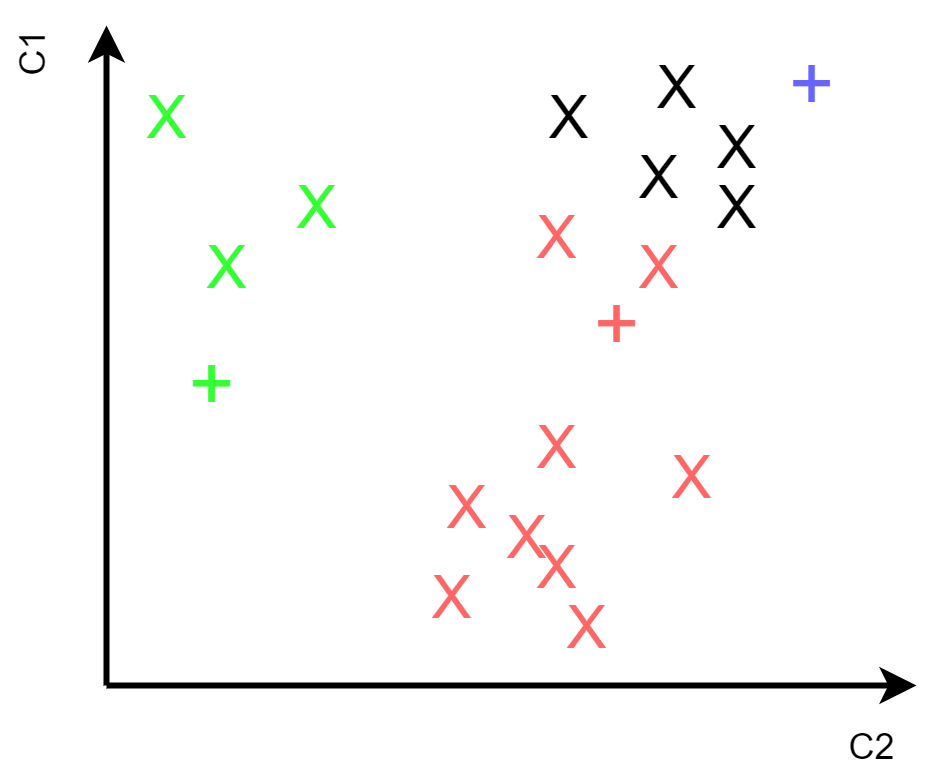

---
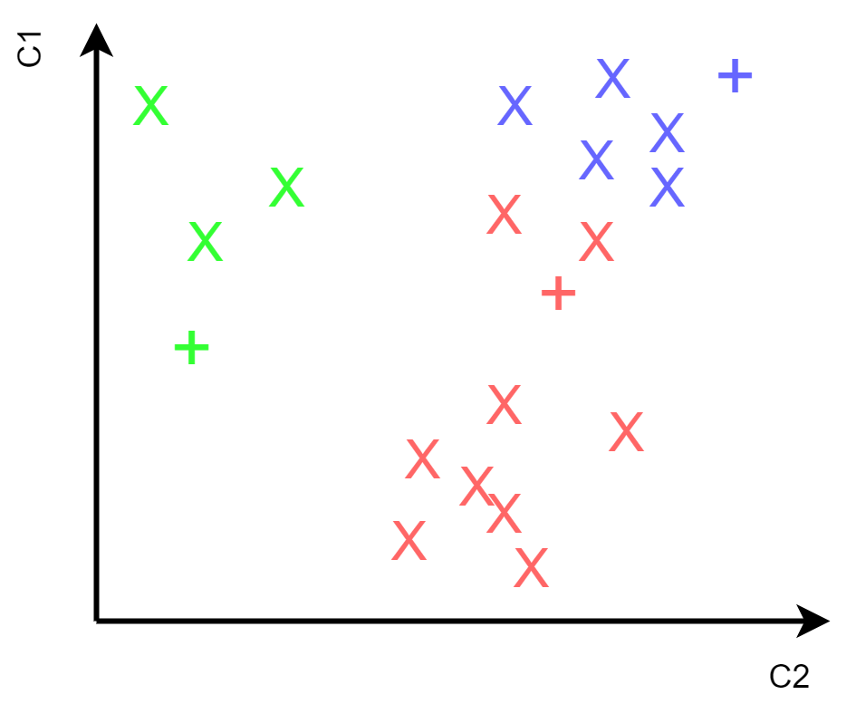

---
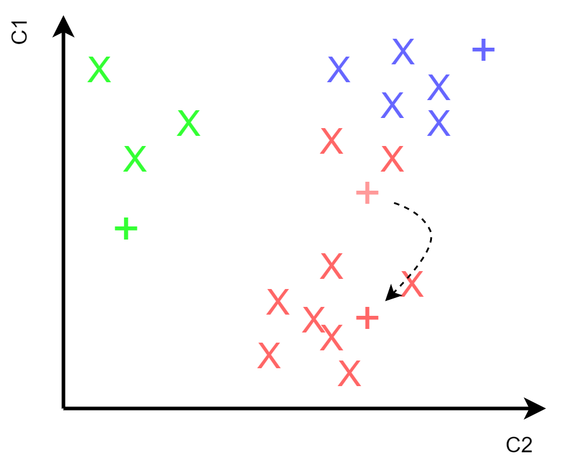

---
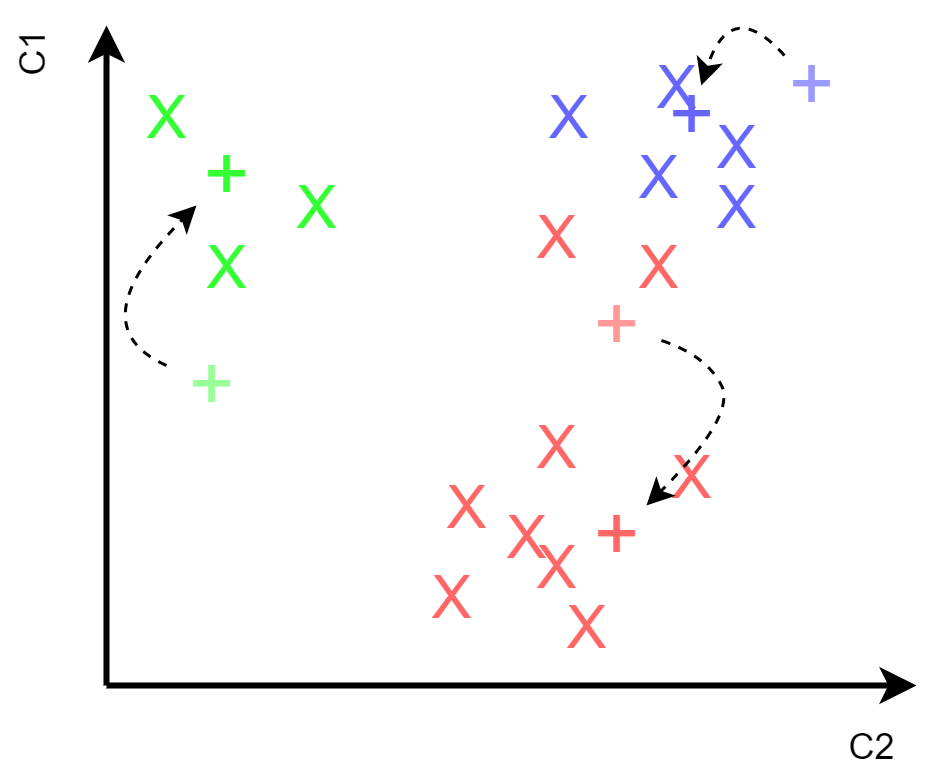

---
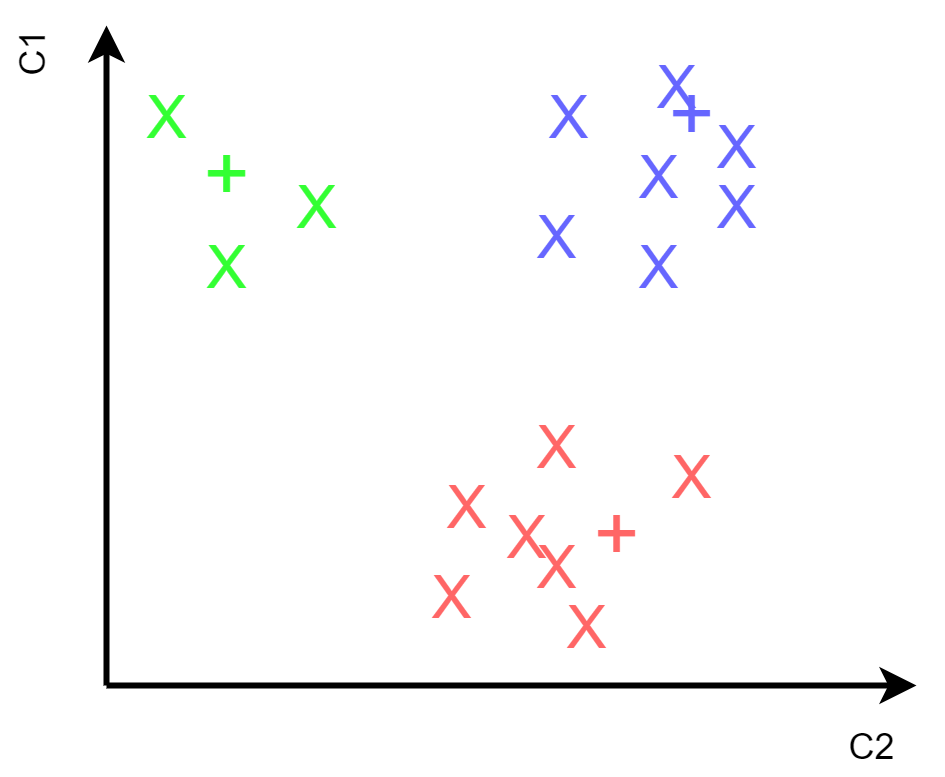

---
 $$J = \sum^k_{j=1}\sum^n_{i=1} \|x^{(j)}_i - c_j \|^2 $$

--

 $$\min J$$

---
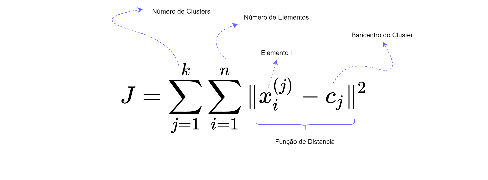

---

---
# ⛑️ Cuidados

---

> Todos os Modelos estão **errados** mas alguns são úteis

###### **George E. P. Box**

---

* ### Dados Normalizados
  -  Distância euclidiâna é fortemente afetada pela unidade de medida

---
* ### Variavéis Categóricas

---
* ### Dependência do K
  - Decisão Subjetiva
---

---

---
* ### Dependência do K
  - Decisão Subjetiva
  - Método do cotovelo
---
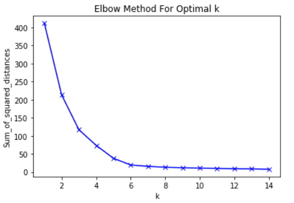

---
* ### Dependência do ponto de inicialização
  -  A solução encontrada é fortemente dependente dessa condição inicial
  - K-means ++

---

# 🧠 Mão Na Massa

---

# ✅ Conclusão
---

# Referências

---

* Han, J., Pei, J., & Kamber, M. (2011). Data mining: concepts and techniques. Elsevier.

* JAIN, Anil K. Data clustering: 50 years beyond K-means. Pattern recognition letters, v. 31, n. 8, p. 651-666, 2010.

* Romesburg, Charles. Cluster analysis for researchers. Lulu. com, 2004.

* SEEJA, K. R.; ZAREAPOOR, Masoumeh. FraudMiner: A novel credit card fraud detection model based on frequent itemset mining. The Scientific World Journal, v. 2014, 2014.

* Thiprungsri, S., & Vasarhelyi, M. A. (2011). Cluster Analysis for Anomaly Detection in Accounting Data: An Audit Approach. International Journal of Digital Accounting Research, 11.
---

# Obrigado 🚀
---

<!-- palette: #B5D6B2(green),darkslateblue,#dd6e42(orange),#FFFACC(cream) -->